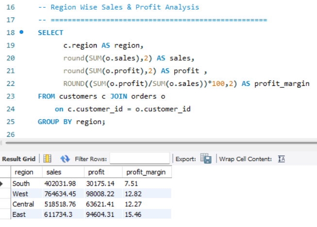
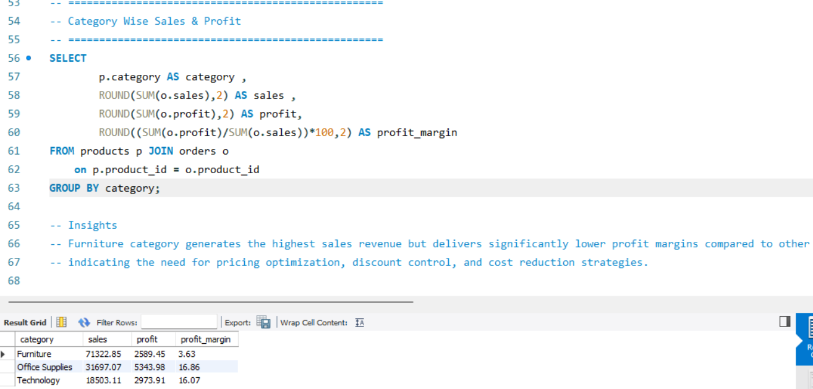
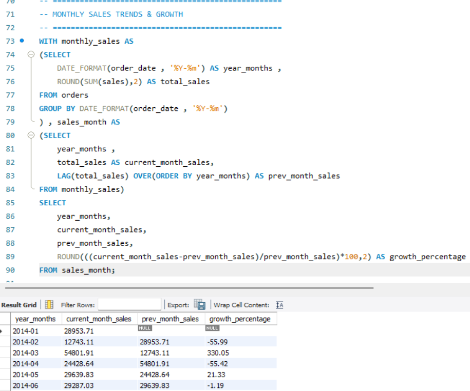

# SQL E-commerce Sales Analysis

This project focuses on analyzing sales performance, profitability, customer behavior, and regional trends using SQL.

## SQL Concepts Used
- Joins
- CTEs
- Window Functions
- Aggregations
- LAG Function
- Business Insights

## Key Analysis Areas
- Region-wise Profitability
- Monthly Sales Growth
- Customer Analysis
- Product Performance
- Loss-Making States

## 📷 Query Previews

### 🌍 Region Wise Sales & Profit Analysis

### 📦 Category Wise Sales & Profit Analysis

### 📈 Monthly Sales Trends & Growth Analysis

